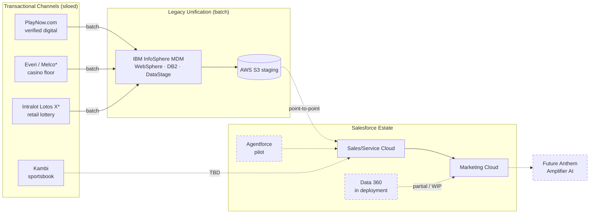

# Current State Architecture

> [!NOTE]
> **Pre-kickoff run (2026-06-25):** the system inventory below is from desk research and is unusually complete for a pre-kickoff DRA, but **integration mechanics are not yet customer-confirmed** (the open questions in [[01-strategic-alignment]] and the deep research are exactly these). Validate Melco streaming, Everi write-back, and Data 360 progress at the kickoff / technical interviews.

**Maps to:** DRA Report Section 4 (Solution Design & Architecture) — current state half
**Drives output:** [[06-target-state-architecture]], [[04-data-value-chain]] (Connect / Integrate scores), architecture diagram in readout

---

## System Inventory

| System | Category | Role | Integration Status | Notes |
|---|---|---|---|---|
| Salesforce CRM (Sales/Service) | CRM | Player relationship & service mgmt across Marketing, BT, eGaming, Lottery, CSC | API-connected | Long-standing (10+ yr customer) [[inputs/research/deep-research]] |
| Salesforce Marketing Cloud | Marketing / Activation | Campaigns, journeys, loyalty comms | API-connected | Core platform; renewal Apr 2027 [[inputs/research/org62-account-snapshot]] |
| Salesforce Data 360 (Data Cloud) | Data Platform / CDP | Target real-time unification & activation layer | In deployment | Replacing InfoSphere MDM; CDP work resuming with Slalom [[inputs/research/deep-research]] |
| Salesforce Chat (ex-Live Agent) | Service | Web/PlayNow chat, conversational routing | API-connected | Integrated 2017 [[inputs/research/deep-research]] |
| Talkdesk for Salesforce | Contact Center | Voice, speech analytics, sentiment (AWS Polly) | API-connected | [[inputs/research/deep-research]] |
| Agentforce | AI / Agents | 3 pilot seats; diagnostics & concierge use cases | Pilot | On unverified foundation [[inputs/research/workspace-inventory]] |
| IBM InfoSphere MDM | Custom / Legacy MDM | Back-office "golden record" of player master data | Batch ETL | Being replaced; rigid, batch-only [[inputs/research/deep-research]] |
| Everi Compliance | Compliance / Legacy | Casino transaction monitoring, KYC, FINTRAC reporting (22 casinos) | Batch / unclear | Write-back capability is an open question [[inputs/research/deep-research]] |
| Intralot Lotos X Omni | Transactional (Lottery) | Retail lottery platform (~8,000 terminals / 3,400 locations) | Cloud Shared Services | Modernized platform, Sept 2026 go-live [[inputs/research/deep-research]] |
| Melco Gaming Platform | Transactional (Casino) | Casino floor GMS — cardless / mobile player tracking | New — TBD | Sept 2026 go-live; streaming capability unconfirmed [[inputs/research/deep-research]] |
| Kambi Sportsbook | Transactional (Sports) | Sports betting (joint w/ Atlantic Lottery) | Turnkey / TBD | Selected Apr 2026 [[inputs/research/deep-research]] |
| Future Anthem Amplifier AI | Analytics / ML | Real-time personalization (AnthemXT hub) | Streaming-dependent | Needs real-time event feed [[inputs/research/deep-research]] |
| PlayNow.com | Transactional (Digital) | Regulated digital channel; fully verified accounts | API / web | Verified-player gold standard [[inputs/research/deep-research]] |
| WebSphere / DB2 / Cast Iron / DataStage | Legacy Infrastructure | Middleware + DB supporting InfoSphere MDM | Batch | High-maintenance legacy [[inputs/research/deep-research]] |
| AWS S3 | Storage | Intermediate data staging | Batch | Copy/move staging [[inputs/research/workspace-inventory]] |
| ~~MuleSoft~~ | Integration (removed) | Former enterprise integration platform | **Discontinued** | "Kicked out 2–3 yrs ago" — left an integration gap [[inputs/research/slack-history]] |

---

## Layer 5: Data Foundation

**What they have:** Channel-siloed transactional stores (PlayNow, Everi/Melco floor, Intralot retail, Kambi sports), legacy InfoSphere MDM on DB2, and AWS S3 staging. Data 360 is being introduced as the new foundation. [[inputs/research/deep-research]]

**Pain points:** Data lives in four disconnected channels with no spanning store; retail lottery is historically anonymous cash; the only unification (InfoSphere) is batch and rigid. [[inputs/research/deep-research]]

## Layer 4: Connectivity, Security & Governance

**What they have:** Legacy WebSphere/Cast Iron/DataStage middleware for batch ETL; **no central integration platform since MuleSoft was removed**; governance historically run out of the CMO's office; heavy external compliance obligations (FIPPA, FINTRAC, IGCO). [[inputs/research/deep-research]] [[inputs/research/workspace-inventory]] [[inputs/research/slack-history]]

**Pain points:** No governed API/event layer; data-quality is "an ambition, not a process"; identity-resolution & consent rules undefined; Everi write-back path unknown. [[inputs/research/workspace-inventory]] [[inputs/research/deep-research]]

## Layer 3: Intelligence & Insights

**What they have:** Marketing Cloud segmentation; Future Anthem Amplifier AI ML models; Agentforce pilots; minimal Tableau footprint (~$15K). [[inputs/research/deep-research]] [[inputs/research/workspace-inventory]]

**Pain points:** Strong decisioning ambition starved of unified, real-time, trusted input — the GIGO risk. [[inputs/research/deep-research]]

## Layer 2: Organizational Readiness

**What they have:** Engaged CIO/CDO (Mark Goldberg) driving the agenda; dedicated Safer Play & Enterprise Integrity function (Kevin deBruyckere); Slalom as implementation SI; long Salesforce partnership. [[inputs/research/workspace-inventory]] [[inputs/research/org62-account-snapshot]]

**Pain points:** Data governance historically owned by marketing, not a data office; the prior CDP effort stalled; AML/Safer Play operational capacity to action real-time alerts is an open question. [[inputs/research/workspace-inventory]] [[inputs/research/deep-research]]

## Layer 1: System of Action

**What they have:** Clear mission and regulatory mandate; a defined target (360-degree player view) and committed business goals (rewards registration 53%→70%). [[inputs/research/deep-research]]

**Pain points:** No semantic model / agreed data definitions; no operative data-lifecycle policy; the strategy exists at the mission level but not yet as a data strategy. [[inputs/research/deep-research]]

---

## Integration Landscape

### Current integration patterns
Predominantly **batch ETL** through legacy WebSphere/DataStage into InfoSphere MDM, with AWS S3 staging and point-to-point connections between channel systems and Salesforce CRM/Marketing Cloud. The removal of MuleSoft left **no governed central integration platform**. [[inputs/research/deep-research]] [[inputs/research/slack-history]]

### Known brittle points
- Batch windows make cross-channel profiles stale by design. [[inputs/research/deep-research]]
- No confirmed real-time outbound API from Melco; Everi write-back path unknown. [[inputs/research/deep-research]]
- Recurring Data Cloud setup, data-action, duplicate-record, and journey-entry failures in org62 indicate a still-maturing integration into Salesforce. [[inputs/research/org62-account-snapshot]]

### Salesforce footprint
Large and growing: CRM (Sales/Service), Marketing Cloud, Data 360 (in deployment), Chat, Talkdesk, Agentforce pilots, Signature Success. Estimated account value ~$4.2M. This footprint makes **Data 360 zero-copy / native activation** the natural unification path rather than another external MDM. [[inputs/research/workspace-inventory]] [[inputs/research/org62-account-snapshot]]

---

## Current State Architecture Diagram

\* Melco (casino) and modernized Intralot (lottery) go live Sept 2026 — their real-time integration paths are unconfirmed. MuleSoft (former integration platform) has been removed, leaving the integration layer as a gap.

---

## Key Observations for Target State

BCLC's current state is a **classic Unlock/Trust foundation gap masked by strong Activate ambition**: a rich Salesforce estate and live ML/agent experiments sit on top of batch, siloed, ungoverned player data. The right entry point is **not** more AI — it is establishing a real-time **Connect/Integrate** layer (Data 360 streaming + a re-established integration/event layer) and a **Unify/Validate/Protect** layer (Data 360 Identity Resolution + data quality + FIPPA/AML-aligned governance) so that the September Activate-layer launches run on a foundation that is safe, compliant, and trustworthy. This is the bridge into [[06-target-state-architecture]].
