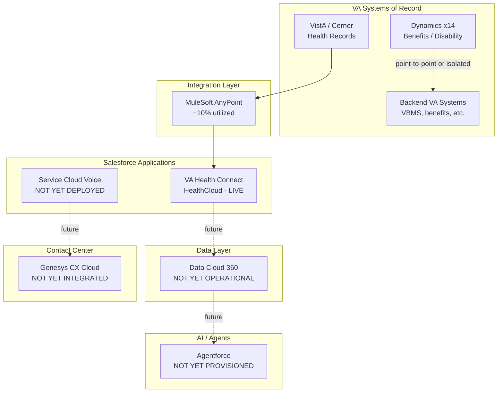

# Current State Architecture

> [!NOTE]
> Built from 7 technical working session transcripts AND Fernando Gonzalez's HLAD (June 17, 2026). The HLAD is the authoritative VA target state document and also clarifies current state scope: 8 named VRM/D365 applications (not a vague "14"), 30+ named VA backend systems, and FedRAMP **High** (not Moderate) as the compliance tier. Where the HLAD contradicts working session assumptions, the HLAD is authoritative. See [[inputs/customer-docs/2026-06-17-va-vrm-all-apps-hlad]].

**Maps to:** DRA Report Section 4 — Solution Design & Architecture (current state half)
**Drives output:** [[06-target-state-architecture]], [[04-data-value-chain]]

---

## System Inventory

**VRM / D365 Applications Being Replaced (Source: HLAD)**

| System | Category | Role | Current State | HLAD Target |
|---|---|---|---|---|
| AVA (Ask VA) — D365 | CRM | Veteran inquiry management, ask.va.gov portal | Live on Dynamics 365 | Service Cloud + Experience Cloud (ask.va.gov) |
| UDO (Benefits) — D365 | CRM | Benefits cases, va.gov portal | Live on Dynamics 365 | Service Cloud + Experience Cloud (va.gov Benefits) |
| CommCare — D365 | CRM | Community care cases | Live on Dynamics 365 | Service Cloud |
| VetHome / P2S — D365 | CRM / Housing | Housing program management, HUD-VASH | Live on Dynamics 365 | Health Cloud (Care Plans, SDOH, HUD-VASH) |
| PATS-R — D365 | CRM / Scheduling | Appointment tracking | Live on Dynamics 365 | Service Cloud |
| Member Services — D365 | CRM | Member services contact management | Live on Dynamics 365 | Service Cloud + Health Cloud |
| WVCC — D365 | CRM | Women Veterans Contact Center | Live on Dynamics 365 | Service Cloud + Health Cloud |
| CDCE-P — D365 | CRM / External | Community care + external contractor management | Live on Dynamics 365 | Service Cloud + LiiS/Pay.gov integrations |

**Salesforce Existing Footprint**

| System | Category | Role | Integration Status | Notes |
|---|---|---|---|---|
| VA Health Connect | CRM | Salesforce HealthCloud for veteran healthcare contact | API-connected (via MuleSoft) | Existing Salesforce footprint; the one live MuleSoft reference implementation |
| Data Cloud 360 | Data Platform | Unified veteran data layer (HLAD: Center of Gravity) | Not yet operational | Purchased; not deployed; HLAD designates it as the replacement for all Dataverse + Azure SQL ODS |
| Service Cloud Voice | CRM / Contact Center | Agent workspace for CCC (target) | Not yet deployed | Requires Genesys Open CTI integration |

**Integration & Data Platform**

| System | Category | Role | Integration Status | Notes |
|---|---|---|---|---|
| MuleSoft AnyPoint Platform | Integration | Central Integration Hub (HLAD mandate); FedRAMP High on VAEC MAG | API-connected (partial) | ~10% of potential scope; no registry; no SI governance patterns yet |
| VEIS Platform Bridge (VAEC MAG) | Azure / Hybrid | Azure AD, Key Vault, Service Bus, Splunk SIEM — VA's Azure environment | Live | Retained in target state; not retired; bridge layer for backend systems in Azure |
| VA Lighthouse | API Gateway | External-facing VA developer API (external only) | API-connected | External-only; not the internal integration governance layer |
| Galaxy Portal | Architecture Tool | Internal architecture visualization | Internal only | Shared credentials; moving to VA.gov domain-based access |

**Contact Center & Workforce**

| System | Category | Role | Integration Status | Notes |
|---|---|---|---|---|
| Cisco Finesse (multiple instances) | Contact Center | Current contact center voice platform | Isolated per app | Distributed across VA sites; retired in HLAD target state |
| Avaya ACD / IVR | Contact Center | Automatic Call Distribution + Interactive Voice Response | Isolated per site | Present alongside Cisco — both platforms in use; retired in HLAD |
| Calabrio ONE | WFM / QA | Workforce management and quality recording | Partial | Deployed across select contact nodes; recording/scheduling |
| Genesys CX Cloud | CCaaS | Unified omnichannel CCaaS (CCC target) | Not yet integrated | HLAD target; replaces all Cisco Finesse + D365 OmniChannel |

**Agent Desktop & Knowledge**

| System | Category | Role | Integration Status | Notes |
|---|---|---|---|---|
| Unified Desktop Optimization (UDO) | Agent Desktop | Custom VBA agent interface; queries up to 25 disparate legacy systems per interaction | Integrated (custom) | Primary driver of high Average Handle Time; the "swivel chair" problem. Retired in HLAD. |
| eGain | Knowledge Management | Standardizes agent answers across benefit lines | Integrated (per line) | Critical for Agentforce: eGain KB will be the RAG source for all Agentforce responses — agents generate answers from eGain content, not generative synthesis |

**CX Measurement**

| System | Category | Role | Integration Status | Notes |
|---|---|---|---|---|
| VSignals | CX Survey / Feedback | Real-time veteran feedback loop; post-interaction surveys | Salesforce integration target | Dr. Lynda Davis / Denise Kitts (VEO) own VSignals; target state blends VSignals sentiment into Tableau supervisor dashboards |

**VA Backend Systems of Record (Source: HLAD — 30+ named systems)**

| System | Category | Integration Pattern | Notes |
|---|---|---|---|
| MPI — Master Person Index | Identity | ⚡ REST Sync, 📡 Event | Primary veteran identity anchor; MuleSoft System API priority |
| VA Profile | Identity | ⚡ REST Sync | Contact preferences, addresses |
| IAM / SSOi | Identity / Auth | ⚡ REST OAuth, 🔒 SAML | Auth layer; connects to Okta/Login.gov |
| VBMS — Veterans Benefits Management | Benefits | ⚡ SOAP/REST, 🔄 Batch Nightly | Primary benefits system; disability claims |
| BGS Gateway | Benefits | ⚡ REST, 📡 Async | Benefits Gateway Services |
| VIERS | Benefits | ⚡ REST, 🔄 Batch | Veterans Integrated Enterprise Reporting |
| VistA — Health Records | Health | ⚡ HL7 v2/REST, 🔄 Batch | Legacy EHR; transitioning to Cerner; migration in progress |
| HDR — Health Data Repository | Health | ⚡ REST, 🌊 Streaming | Consolidated health records |
| FHIR R4 / DHP | Health | ⚡ FHIR REST, 🌊 Pub/Sub | FHIR-standard health data layer |
| VHIE / DTCC Interop | Health / Interop | ⚡ HL7 FHIR, 🌊 HL7 Stream | VA health information exchange |
| VCL — Crisis Line | Health | ⚡ REST, 📡 Real-Time Alert | Veterans Crisis Line integration |
| EAS — Enterprise Appointment Service | Scheduling | ⚡ REST, 📡 Async Callback | Enterprise appointment booking |
| VAOS — Online Scheduling | Scheduling | ⚡ REST Sync | Veteran-facing online scheduling |
| PCMM — Care Management | Scheduling | ⚡ REST, 🔄 Batch | Primary Care Management Module |
| PATS-R | Scheduling | ⚡ REST, 🌊 Bidirectional | Patient Appointment Tracking System |
| ESR — Enrollment System | Enrollment | ⚡ REST, 🔄 Batch Recon | VA health enrollment |
| HUD-VASH Housing Program | Programs | ⚡ REST, 🔄 Batch | Housing program management |
| NCA Cemetery Admin | Programs | ⚡ REST | National Cemetery Administration |
| VA Notify | Comms | 📡 Async REST, 🌊 Push | Veteran notification platform |
| VA.gov / VDIF | Digital | ⚡ REST, 📡 Webhook | VA.gov backend integration |
| Summit / Azure Synapse | Analytics | 🔄 Batch ETL, 🌊 Streaming | Enterprise analytics warehouse |
| Oracle Health / Cerner | Health | ⚡ FHIR REST, 🌊 HL7 Stream | VistA replacement EHR |
| LiiS (CDCE-P) | External | 🔄 Monthly Batch | External contractor system |
| Pay.gov (CDCE-P) | External | ⚡ REST, 🔄 Batch | Government payment system |
| DoD / OIG Network | External | ⚡ REST/MQ, 🔄 Scheduled | DoD interoperability; OIG oversight |

---

## Layer 5: Data Foundation

### What they have

- **VistA** — longitudinal health records, actively migrating to Cerner. Fragmented across environments.
- **Cerner** — replacing VistA; not yet integrated into the Salesforce/MuleSoft stack.
- **Dynamics data stores** — 14 application databases, each scoped to its program. No cross-application data model.
- **Data Cloud 360** — purchased and in scope for the CCC program but not yet operational as a unified layer.

### Pain points

- No unified veteran data store — identity, health, and benefits data exist in separate systems with no reconciliation layer.
- Data Cloud is the stated solution but is not yet deployed; until it is, any AI use case is querying fragmented source systems directly.
- VistA → Cerner migration creates a moving target for integration — the source of truth for health records is in transition.

---

## Layer 4: Connectivity, Security & Governance

### What they have

- **MuleSoft AnyPoint** — deployed at VA; functions as integration middleware for VA Health Connect. FedRAMP compliant. ~10% utilized relative to its potential enterprise scope.
- **FedRAMP Moderate authorization** — active and enforced. All technology must be FedRAMP-authorized before deployment. This is a real, functioning security control.
- **DTC (Digital Transformation Center)** — the formal governance authority for technology access, provisioning, and pattern approval at VA. All new tools and capabilities route through DTC.

### Pain points

- **MuleSoft underutilization** — exists as a point integration tool rather than an enterprise API strategy. No centralized API registry, no reuse policies, no documented patterns for SIs.
- **DTC as bottleneck** — 6+ months to provision Agentforce access; no published roadmap for incoming SIs; no defined integration patterns. FedRAMP governance is real but DTC processes are too slow for the program's pace.
- **Galaxy portal shared credentials** — current access control is a generic username/password. Moving to VA.gov domain-based access is in progress but not complete.
- **No API catalog** — APIs exist in MuleSoft but are not documented or discoverable in a registry format. SIs cannot find and reuse existing integrations.

---

## Layer 3: Intelligence & Insights

### What they have

- **None operational.** Data Cloud / calculated insights / identity resolution are future state.
- VA Health Connect may have basic Salesforce reporting, but no enterprise analytics or ML layer is described in any session.

### Pain points

- Without a unified veteran profile, there is nothing to run intelligence against. The MDM gap at Layer 5 prevents Layer 3 from functioning.
- AI readiness is gated by FedRAMP approval of specific AI features — several capabilities (Agentforce Voice, certain Marketing Cloud channels) are not yet GovCloud-authorized.

---

## Layer 2: Organizational Readiness

### What they have

- **Fernando Gonzalez (OIT Technical Lead)** — sophisticated understanding of the data foundation requirements; actively advocating for foundation-first architecture. Clear technical champion.
- **Mathew Magesh (OIT)** — engaged in architecture sessions; working on Dynamics application decomposition and centralized use case documentation.
- **DTC** — the formal governance body. Has authority but currently operates as an access gatekeeper rather than a strategic enabler.

### Pain points

- **Authority fragmentation:** The team doing the architecture work cannot provision the tools they need. DTC controls access but is not aligned on pace.
- **Leadership expectation gap:** VA leadership expects AI capability on day one. The team understands this is unrealistic but cannot fully manage upward without formal executive alignment sessions.
- **SI governance gap:** No defined patterns, playbooks, or requirements for incoming SIs. Without these, each SI will make independent architecture decisions — recreating the siloed app pattern the CCC program is trying to retire.
- **No single-threaded data governance owner** identified in any session. Data stewardship, quality standards, and lineage accountability are not assigned.

---

## Layer 1: System of Action

### What they have

- **CCC Program mandate** — the Enterprise Council decision to consolidate contact centers on Salesforce is the de facto data strategy for the contact center scope.
- **Architecture vision** — Fernando and the OIT team have a clear "foundation-first" architecture philosophy, documented in the working sessions and beginning to be visible in the Galaxy architecture portal.

### Pain points

- The "architecture vision" is not yet a formal data strategy document — it exists in working sessions and Slack. Until it is written down and approved by leadership, SIs are not bound to follow it.
- No documented data lifecycle policy, semantic model, or ontology for veteran data.
- The CCC mandate is a system-of-action commitment, but it does not extend to the data layer — it says *what* to build (a consolidated contact center) but not *how* the data must be structured to support it.

---

## Integration Landscape

### Current integration patterns

MuleSoft AnyPoint is the nominal integration platform, but integration is ad hoc rather than governed. VA Health Connect (HealthCloud) connects to VA backend systems via MuleSoft — this is the most mature integration in the current state. Beyond that, applications connect point-to-point or are isolated. The 14 Dynamics applications have no shared integration layer; each was built to serve its program independently.

The team's circular architecture diagram places MuleSoft at the center, with VA systems of record as the inner ring and Salesforce applications as the outer ring — this is the *target state* framing, not a description of what exists today.

### Known brittle points

- **VistA → Cerner migration** — the health records source of truth is in flux. Any integration built against VistA will need to be rebuilt against Cerner.
- **Dynamics application boundaries** — 8 named VRM apps (per HLAD) each with its own data model and integration pattern.
- **DTC provisioning delays** — any new integration that requires DTC approval (new MuleSoft API, new Salesforce capability) faces a 6+ month queue.
- **FedRAMP High feature lag** — capabilities available in commercial Salesforce are 12–18 months behind on GovCloud FedRAMP High; planning must account for this.
- **56,000 transactions per second** — VistA + Corporate Data Warehouse combined peak throughput enterprise-wide. Direct synchronous polling by 280+ call center nodes places unsustainable load on legacy databases. Requires event-streaming + circuit-breaker + cache architecture in MuleSoft before direct system queries are replaced.
- **UDO 25-system swivel chair** — VBA agents currently navigate up to 25 separate legacy systems per interaction. This is not just a UX problem — it reflects the absence of any unified data layer. Until the MuleSoft System API registry and Data Cloud unified profile exist, replacing UDO with a Salesforce console does not solve the underlying problem.
- **VA Profile write-back failures** — changes to veteran contact info in local IVR systems or CRM instances frequently fail to write back synchronously to VA Profile (the authoritative MDM). This causes data decay across the contact center — agents see outdated addresses, wrong phone numbers, failed outreach. The fix is bidirectional MuleSoft event streaming to VA Profile, not batch reconciliation.

### Salesforce footprint

- **VA Health Connect (HealthCloud)** — live, connected to VA backend via MuleSoft. The most mature Salesforce deployment and the reference implementation for the CCC architecture.
- **Service Cloud Voice** — purchased for CCC program; not yet deployed.
- **Data Cloud 360** — purchased; not yet operational. HLAD designates this as the "Center of Gravity" replacing all Dataverse, Azure SQL ODS, and Data Factory.
- **Agentforce** — purchased (as part of new June 2026 license); not yet provisioned (DTC blocking for 6+ months).
- **Marketing Cloud** — email channel is FedRAMP-compliant; SMS and mass messaging channels are pending FedRAMP authorization.
- **Experience Cloud** — target for all 6 veteran-facing portals (ask.va.gov, VetHome, va.gov Benefits, MSP/MHV, cdcportal, womenshealth); not yet deployed.

> [!WARNING]
> **FedRAMP tier correction:** Working sessions discussed FedRAMP Moderate. Fernando's HLAD (Jun 17, 2026) specifies **FedRAMP High + DoD IL4** as the target compliance tier for SFGCP-E GCC. This is a higher compliance bar with potentially different feature availability timelines. Confirm with Salesforce PS team which specific capabilities are available on the FedRAMP High tier before finalizing roadmap commitments.

---

## Current State Architecture Diagram

---

## Key Observations for Target State

The current state is a classic pre-consolidation federal architecture: the right platform (MuleSoft) exists but is dramatically underutilized, the right data layer (Data Cloud) is purchased but not operational, and the AI capability (Agentforce) is licensed but blocked by governance. The one live integration — VA Health Connect via MuleSoft — is proof that the architecture works when properly deployed.

The target state is not a rip-and-replace — it is an expansion of the working Health Connect pattern to enterprise scale, with MuleSoft repositioned as the mandatory integration backbone for all CCC application development. The highest-leverage intervention is DTC governance reform: publishing patterns, unblocking access, and requiring SIs to use the registry rather than build around it.
