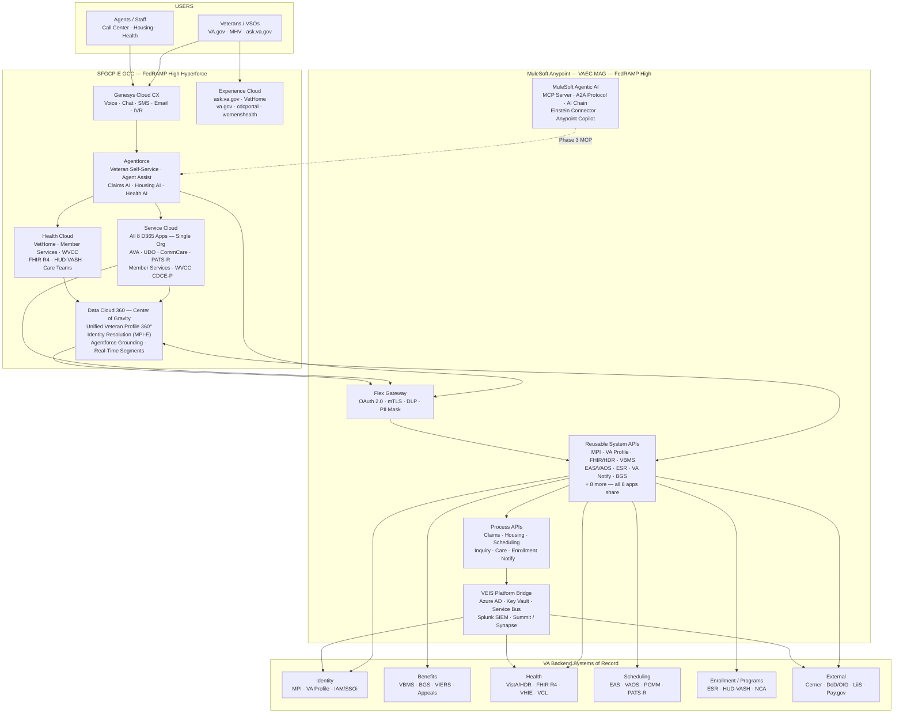

# Target State Architecture

> [!NOTE]
> This page is grounded in two authoritative sources: (1) Fernando Gonzalez's (VA OIT) HLAD — the VA target state architecture document dated June 17, 2026 — and (2) the VA Galaxy View architecture site (https://storm-8dc9a734e7b33e.my.site.com/vacccarchitecture), extracted Aug 3, 2026. The Galaxy View was built collaboratively with the Salesforce SE team and is the public-facing visual representation of the same architecture. Where the two sources align, confidence is high. See [[inputs/customer-docs/2026-06-17-va-vrm-all-apps-hlad]] and [[inputs/research/2026-08-03-va-galaxy-view-architecture]] for full structured extractions.

**Maps to:** DRA Report Section 4 — Solution Design & Architecture (target state half)
**Reads from:** [[04-data-value-chain]], [[05-current-state-architecture]], [[01-strategic-alignment]], [[inputs/customer-docs/2026-06-17-va-vrm-all-apps-hlad]], [[inputs/research/2026-08-03-va-galaxy-view-architecture]]
**Drives output:** Architecture diagram slide, Solution Design section of the report

---

## Design Principles

These principles govern every architectural choice — derived directly from Fernando's HLAD and the working session findings.

1. **MuleSoft as mandatory central hub, not an option.** Every application integration — all 8 D365 migrations, all VA backend system calls — routes through MuleSoft Anypoint. No application talks directly to a backend system. This prevents the SI-driven silo pattern Fernando is "fighting every single day."

2. **Build once, reuse everywhere.** Each VA backend system gets one MuleSoft System API. All 8 migrated applications call the same API — not separate integrations per app. This is the "reusable System API" pattern from the HLAD, and it's the design principle that makes the phased migration de-risk possible.

3. **Data Cloud as center of gravity, not an add-on.** Data Cloud explicitly replaces all Dataverse, Azure SQL ODS, and Azure Data Factory. It is the unified veteran data layer. Every application that needs veteran profile data reads from Data Cloud — not from the source systems directly.

4. **FedRAMP High, DoD IL4.** The HLAD targets FedRAMP High (not Moderate) on Hyperforce GovCloud. All feature availability and timeline commitments must be qualified against FedRAMP High availability — which has a stricter compliance boundary than Moderate.

5. **VEIS Platform Bridge retained (hybrid cloud).** The Azure VAEC MAG environment is not retired. It is the bridge layer between MuleSoft and VA backend systems that require Azure AD, Key Vault, Service Bus, or Splunk SIEM. The architecture is hybrid: Salesforce GovCloud (SFGCP-E) + Azure VAEC MAG, connected via MuleSoft.

6. **Single Salesforce org.** All 8 VRM applications consolidate into one SFGCP-E org. No multi-org sprawl. Shared Knowledge Base, shared Omni-Channel Routing, shared Data Cloud profile.

7. **Governance before SIs.** The API registry, integration patterns, and SI requirements playbook must be in place before any System Integrator is onboarded. Without this, each SI defaults to their own integration approach, recreating silos on Salesforce rather than eliminating them from Dynamics.

---

## Layer 5 → Target: Data Foundation

### Recommended Changes

- **Retire** all Dataverse instances (8 app-specific), Azure SQL ODS, and Azure Data Factory ETL pipelines. These are the Blind Spot sources — fragmented veteran data stores with no unified identity layer.
- **Deploy** Salesforce Data Cloud 360 as the unified veteran data platform, replacing Dataverse as the operational data store for all 8 migrated applications.
- **Establish** unified veteran identity resolution in Data Cloud using MPI-E (Master Person Index — Enterprise) as the identity anchor, with FHIR R4 ingestion from HDR and HUD-VASH + VBMS sync for benefits identity.
- **Continue** VistA → Oracle Health/Cerner migration; configure MuleSoft FHIR R4 API to abstract the transition so application integrations don't break during the VistA cutover.

### Salesforce Role at This Layer

- **Data Cloud — Unified Veteran Profile 360°:** Identity resolution across MPI-E (health), VBMS (benefits), ESR (enrollment), PATS-R + AVA (contact history). This is the single veteran record that all 8 apps and all Agentforce agents read from.
- **Data Cloud — Real-Time Segmentation:** Veteran cohort segmentation for proactive outreach (e.g., veterans enrolled in housing programs with open claims, veterans with recent crisis line contact).
- **Data Cloud — Agentforce Grounding:** Data Cloud calculated insights surface as context cards in the Agentforce agent workspace — every agent interaction is grounded in the veteran's current state, not a stale CRM snapshot.
- **Data Cloud — Databricks Zero Copy (Summit):** The Galaxy View explicitly labels the Databricks Summit connection as "ZERO-COPY to Data 360." This means VA's existing Databricks/Summit analytics data warehouse does not require ETL migration — Data Cloud reads it in place via Zero Copy architecture. This significantly de-risks and accelerates the Data Cloud adoption timeline by eliminating a batch migration dependency.
- **Data Cloud — Summit Synapse Connector:** Bidirectional sync to Azure Summit/Synapse for enterprise analytics and reporting that spans VA-wide data beyond the Salesforce footprint.
- **Data Cloud — Agentic Memory:** Explicitly listed as a Data 360 component in the Galaxy View. Persistent agent session state must be architecturally designed into the Data Cloud schema — Agentforce agents need to recall prior veteran interactions across sessions.

---

## Layer 4 → Target: Connectivity, Security & Governance

### Recommended Changes

- **Reposition MuleSoft from point integration tool to mandatory enterprise backbone.** Today MuleSoft powers VA Health Connect. The target state has 15+ System APIs and 10+ Process APIs serving all 8 migrated applications. This is a governance change as much as a technical change — the MuleSoft registry must become a required entry point, not an optional routing layer.
- **Build the Reusable System API registry.** Each VA backend system gets exactly one MuleSoft System API, documented in Anypoint Exchange, governed by API Manager, and reused across all 8 applications. The 15 named System APIs from the HLAD are the Phase 1 registry target:
  - Identity: MPI API, VA Profile API, IAM/SSOi API, NPI Provider API
  - Benefits: VBMS Benefits API, BGS Gateway API, VIERS API
  - Health: FHIR/HDR API, VCL Crisis Line API
  - Scheduling: EAS/VAOS Scheduling API
  - Enrollment: ESR Enrollment API
  - Notifications/Comms: VA Notify API, SharePoint Connector API
  - External: LiiS + Pay.gov APIs
  - Analytics: Summit/Synapse API
- **Deploy Flex Gateway as API security layer.** OAuth 2.0/mTLS/JWT, Key Vault integration, DLP + PII masking, FedRAMP/IL4 controls, rate limiting. All API traffic must pass through Flex Gateway — no direct calls from Salesforce to VA backend.
- **Publish SI integration patterns** via Anypoint Exchange. Incoming SIs are required to use registered System APIs. New backend integrations must be registered in the Exchange before being used in any application. DTC governs the approval of new APIs but using a published, pre-approved API requires no new DTC approval.
- **Retain VEIS Platform Bridge (VAEC MAG).** Azure AD/EntraID for identity, Key Vault for secrets, Traffic Manager and Service Bus for async messaging, Splunk SIEM for security monitoring. MuleSoft talks to VEIS via the VEIS APIM Gateway — VEIS remains the edge for backend systems that live in the Azure environment.

### Salesforce Role at This Layer

- **MuleSoft Anypoint Platform (CloudHub 2.0 on VAEC MAG):** FedRAMP High certified; all integration flows run here.
- **MuleSoft Flex Gateway:** API security enforcement layer — replaces KingswaySoft and per-app VEIS calls as the integration governance mechanism.
- **MuleSoft Agentic AI capabilities:** MCP Server support, A2A Protocol, AI Chain API, Einstein AI Connector — enables Agentforce agents to dynamically invoke MuleSoft APIs via Model Context Protocol rather than hardcoded integrations. Phase 3 capability but should be architecturally designed in from the start.
- **Anypoint Exchange + Anypoint Monitoring + Anypoint Copilot:** API catalog, observability, and AI-assisted API development.

---

## Layer 3 → Target: Intelligence & Insights

### Recommended Changes

- **Deploy Data Cloud calculated insights** for veteran-level intelligence: claim status trajectories, housing stability scores, appointment adherence patterns, crisis risk signals. These insights surface in the Agentforce agent workspace as context — not as separate BI dashboards that agents must navigate to.
- **Configure Agentforce Data Cloud grounding** so every agent topic has access to the veteran's unified profile as context, reducing the reliance on agent memory or manual lookups.
- **Replace Fusion BI / Power BI** with CRM Analytics + Tableau for program-level reporting. Summit Synapse connector enables enterprise analytics across the full VA data landscape.
- **Einstein Discovery** for predictive recommendations: next-best-action in the agent workspace, escalation risk scoring, enrollment gap identification.

### Salesforce Role at This Layer

- **Data Cloud Real-Time Segmentation:** Proactive veteran outreach triggers based on profile state changes (new claim filed, appointment missed, crisis line contact flagged).
- **CRM Analytics:** Contact center supervisor dashboards — wait times, resolution rates, CSAT by line of business, all in one view (replacing 8 separate Dynamics reports).
- **Einstein Discovery + Next-Best-Action:** Agent-facing recommendations in the Agentforce workspace.
- **Summit Synapse Connector:** Bridge to enterprise VA analytics beyond the Salesforce footprint.

---

## Layer 2 → Target: Organizational Readiness

### Recommended Changes

- **DTC must become an enabler, not a gatekeeper.** The current 6+ month Agentforce access blockage is the single largest threat to this program. The target state requires DTC to publish a governance playbook, establish pre-approved patterns, and create a fast-track path for Salesforce/MuleSoft feature provisioning. Without this, the architecture cannot be validated.
- **Define mandatory SI integration requirements** and embed them in the RFx solicitation. Incoming SIs must: (a) use MuleSoft System APIs from the registry, (b) not build direct application-to-backend integrations, (c) register any new APIs in Anypoint Exchange before use. This is the governance artifact the Aug 24 architecture deliverable must produce.
- **Assign a single-threaded data governance owner** for the unified veteran data platform. Someone must own the Data Cloud semantic model, identity resolution rules, and data quality standards. This role does not currently exist — it needs to be established before Data Cloud goes operational.
- **Establish the API governance board** (likely a DTC sub-committee) to approve new System APIs, govern the Anypoint Exchange registry, and enforce reuse mandates. This is the organizational change that makes "build once" durable.

### Salesforce Role at This Layer

- **Anypoint Exchange:** The API catalog is the governance artifact. SIs see what's available; DTC approves what gets published; architects design against registered APIs.
- **Anypoint Monitoring + Splunk SIEM integration:** Operational visibility for the governance board — who is calling what, how often, and whether any application is bypassing the registry.
- **FedRAMP High certification:** The compliance framework is already defined. DTC's job is to operationalize it, not create a new one.

---

## Layer 1 → Target: System of Action

### Recommended Changes

- **Deploy Agentforce across all 8 VRM applications** (single Salesforce org). The Galaxy View defines 4 canonical agent roles (confirmed Aug 3, 2026); the HLAD provides additional functional decomposition:

  **Galaxy View — 4 canonical Agentforce agents (authoritative):**
  - *CC Agent (Contact Center Agent):* Primary veteran-facing AI — handles inbound inquiries, routes, and deflects where appropriate
  - *Supervisor Agent:* Supervisor-facing — surfaces real-time insights, flags at-risk cases, supports quality monitoring
  - *Veteran Agent:* Veteran self-service — autonomous interactions on VA.gov / Experience Cloud portals
  - *MSA Agent (Medical Support Assistant):* Clinical contact center and scheduling workflows (confirms VA Health Connect / VHA scope within CCC Agentforce plan)

  **HLAD functional decomposition (maps to the 4 canonical roles above):**
  - *Veteran Self-Service AI:* VA.gov + ask.va.gov deflection, claim status lookups, appointment scheduling without agent
  - *AI Agent Assist / Einstein Copilot:* Real-time suggestions in the agent workspace (next-best-action, case summary, knowledge article surfacing)
  - *Claims & Appeals AI:* Guided case intake, automated routing, SLA monitoring
  - *Housing AI Agent:* HUD-VASH program enrollment guidance, SDOH assessment support
  - *Health/Scheduling AI (MSA Agent):* Appointment booking, care team routing, MHV Bridge integration
  - *WVCC Care Agent:* Women Veterans Contact Center specialization
  - *Inquiry Routing AI:* Intelligent routing across all 8 lines of business based on veteran profile + intent
- **Deploy Genesys Cloud CX** as unified omnichannel platform, replacing all Cisco Finesse and D365 OmniChannel instances. Integrate via Salesforce Open CTI — Genesys events drive case creation and veteran profile surfacing in the SF agent workspace.
- **Deploy Experience Cloud** across all 6 veteran-facing portals, replacing all Power Pages: ask.va.gov, VetHome/P2S, va.gov Benefits, MSP + MHV, cdcportal.va.gov, womenshealth.va.gov.

### Salesforce Role at This Layer

- **Agentforce (Service Cloud + Health Cloud):** The action layer — agents and AI working together in a unified workspace grounded by Data Cloud veteran profiles.
- **Service Cloud Omni-Channel Routing:** Intelligent routing across all 8 lines of business in a single org — replaces 8 separate Dynamics routing configurations.
- **Experience Cloud:** Veteran-facing digital portals — self-service before it reaches the contact center.
- **MuleSoft MCP Server + A2A Protocol (Phase 3):** Agentforce agents that dynamically discover and invoke backend APIs without hardcoded integrations — the fully agentic end state.

---

## Target State Architecture Diagram

---

## Capability Gap Summary

| Capability | Current Score | Gap | Recommended Action | Salesforce Capability |
|---|---|---|---|---|
| Connect | 1 | No real-time data flow; 14+ isolated systems | Deploy MuleSoft System APIs for all VA backend systems; Data Cloud streaming ingestion | MuleSoft Anypoint + Data Cloud Streaming |
| Integrate | 2 | MuleSoft exists but ungoverned; no registry | Publish all 15 System APIs in Anypoint Exchange; mandate SI reuse; retire KingswaySoft + per-app VEIS calls | MuleSoft Flex Gateway + Anypoint Exchange |
| Understand | 1 | No semantic model; no data dictionary | Define veteran data model in Data Cloud schema; align MuleSoft API contracts to veteran data ontology | Data Cloud Schema + Anypoint Catalog |
| Unify | 1 | 8 isolated D365 apps; no unified veteran identity | Deploy Data Cloud identity resolution against MPI-E + VBMS + ESR; retire all Dataverse ODS | Data Cloud Unified Veteran Profile 360° |
| Validate | 1 | No data quality program; no lineage | Flex Gateway schema validation on all API calls; Data Cloud quality monitoring; MuleSoft Anypoint Monitoring | MuleSoft Anypoint Monitoring + Data Cloud |
| Protect | 2 | FedRAMP compliance exists; DTC governance doesn't scale | DTC governance playbook; pre-approved API patterns; Flex Gateway DLP + PII masking | MuleSoft Flex Gateway + Shield + FedRAMP High |
| Decide | 1 | No analytics; decisions made without data | CRM Analytics supervisor dashboards; Einstein Discovery next-best-action; Data Cloud segmentation | CRM Analytics + Einstein Discovery + Data Cloud |
| Orchestrate | 1 | Agentforce unprovisioned; DTC blocking | DTC must provision Agentforce (critical path); deploy topic-specific agents per HLAD design | Agentforce (all 8 app agents) + MuleSoft A2A |
| Act | 1 | No unified agent workspace; multi-system navigation | Service Cloud single org for all 8 apps; Genesys Open CTI integration; Data Cloud grounding in agent workspace | Service Cloud + Genesys CX + Agentforce Desktop |

---

## Key Upgrade: HLAD vs. Working Session Assumptions

> [!WARNING]
> The HLAD (Fernando's architecture document, dated Jun 17, 2026) reveals several significant differences from what the working sessions described. The DRA readout must reflect the HLAD — not the more conservative working session framing.

| Topic | Working Session Assumption | HLAD Reality | DRA Implication |
|---|---|---|---|
| FedRAMP tier | Moderate | **High + DoD IL4** | Feature availability timelines are stricter; confirm Agentforce/Data Cloud FedRAMP High availability |
| D365 app count | "~14 Dynamics apps" | **8 named VRM apps** (may be the VRM subset; other apps may be separate programs) | Scope clarity needed: are the 8 named apps the full CCC scope, or are there additional apps not in VRM? |
| VA backend systems | "VA backend systems (unspecified)" | **30+ named systems** with specific integration patterns | HLAD is the source of truth for System API scope — use it to define the Phase 1 API registry |
| VEIS / Azure | Implied retirement | **VEIS Platform Bridge retained** | Hybrid architecture confirmed; VAEC MAG is permanent, not transitional |
| Data Cloud role | "Future state, to be operational" | **Center of Gravity, explicitly replacing Dataverse + Azure SQL ODS + Data Factory** | Data Cloud deployment is not optional — it is the platform replacement |
| Agentforce timeline | "Phase 2+" | **Named agents for all 8 apps in the HLAD** | Fernando's architecture expects Agentforce; the DTC blockage is the gap, not the architecture intent |

---

## Galaxy View Architecture Alignment

> [!NOTE]
> The Galaxy View (https://storm-8dc9a734e7b33e.my.site.com/vacccarchitecture) is the public-facing visualization of this architecture, built collaboratively by the Salesforce SE team and VA OIT. It confirms and extends the HLAD on several points. Source: [[inputs/research/2026-08-03-va-galaxy-view-architecture]].

### New findings from the Galaxy View (not in HLAD)

| Finding | Galaxy View Evidence | DRA Impact |
|---|---|---|
| **4 named Agentforce agents** | Layer 5: CC Agent, Supervisor Agent, Veteran Agent, MSA Agent | Canonical agent scoping confirmed; MSA Agent confirms VHA/Health Connect in CCC Agentforce scope |
| **Databricks Zero Copy** to Data Cloud | Layer 3 description + Layer Cake VA Systems | Summit data warehouse available to Data Cloud without ETL migration — reduces adoption risk |
| **MCP as named protocol** | Layer 2 + use case step 3: "Agentforce → MuleSoft MCP Server" | MCP is the designed A2A protocol for Agentforce-to-MuleSoft calls — must be in architecture deliverable |
| **Agentic Memory** as Data Cloud component | Layer 3 component list | Persistent agent session state is a first-class Data Cloud requirement |
| **PACT Act Next Best Action** | Use case step 13 | Data Cloud segmentation must include PACT Act eligibility logic — specific, named VA legislative use case |
| **Phase 1 = "Today"** framing | Layer Cake phase dropdown | Channel consolidation is the current-state deliverable; AI augmentation (Phase 2) and Agentic future (Phase 3) are forward-stated |
| **BYOT** designation for Genesys | Layer Cake: "BYOC → BYOT Connector" | BYOT (Bring Your Own Telephony) is the specific Genesys integration model — confirms full Salesforce routing and context ownership |

### 3-Phase architecture evolution (Layer Cake)

| Phase | Label | Description | Roadmap Alignment |
|---|---|---|---|
| 1 | Today | Channels consolidated on one platform. Reps drive interactions; APIs move data between systems. | Crawl phase — [[07-roadmap]] |
| 2 | AI-augmented | (Content not extracted — available in Layer Cake dropdown) | Walk phase |
| 3 | Agentic future | (Content not extracted — available in Layer Cake dropdown) | Run phase |

> [!WARNING]
> Phase 2 and Phase 3 Layer Cake content was not captured in this session. A follow-up browser session should extract this content to complete the roadmap narrative. This content likely maps directly to the Walk and Run phases in [[07-roadmap]] and would be valuable for the Aug 24 readout.

### 5 Mission Outcomes (Galaxy View — Layer Cake)

These are the stated program outcomes on the architecture site — use these for the readout:

1. Deliver a seamless, unified experience for every Veteran — across every channel
2. Resolve veteran inquiries faster with AI-assisted agents
3. Connect siloed VA systems into a single source of truth
4. Automate routine interactions so agents focus on complex needs
5. Give leadership real-time visibility into contact center performance

---

## Open Architecture Questions

- [ ] **FedRAMP High availability dates for Agentforce and Data Cloud** — the HLAD targets FedRAMP High; confirm which specific capabilities are available on the FedRAMP High tier vs. what was previously assumed at Moderate
- [ ] **Scope of "8 VRM apps" vs. Fernando's "14 Dynamics apps"** — are the 8 named apps the full CCC consolidation scope, or are there additional Dynamics apps outside the VRM program?
- [ ] **DTC Agentforce provisioning path** — what is the specific request Fernando/Mark Ennis need to make to DTC, and who is the DTC decision-maker? This is the #1 critical-path blocker.
- [ ] **Phase 1 System API priority order** — of the 15 named System APIs, which are required for National Contact Center go-live? MPI + VA Profile + EAS/VAOS are likely mandatory; others can follow.
- [ ] **Data governance owner** — who at VA owns the Data Cloud semantic model, identity resolution rules, and quality standards? This role must be named in the architecture deliverable.
- [ ] **Galaxy View Phase 2 and Phase 3 content** — extract the "AI-augmented" and "Agentic future" Layer Cake views to complete the roadmap narrative before the Aug 24 readout
- [ ] **PACT Act eligibility logic** — who owns the PACT Act segmentation rules? This is a Data Cloud calculated insight requirement tied to a specific VA legislative mandate — needs a named VA owner
- [ ] **Agentic Memory schema** — what persistent state does each of the 4 Agentforce agents need? Must be designed into Data Cloud schema before agent development begins
