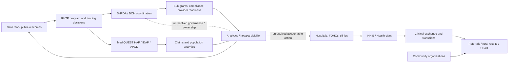

# Current State Architecture

**Maps to:** DRA Report Section 4 — Solution Design & Architecture, current-state half

> [!WARNING]
> This is an evidence-backed hypothesis map, not a confirmed technical inventory. The next architecture interview must validate system ownership, interfaces, data domains, and current operating procedures.

## System Inventory — public research signals

| System / domain | Role described in research | Current-state confidence | Validation needed |
|---|---|---|---|
| SHPDA / DOH program operations | Health planning, RHTP coordination, grants and provider-program administration | Medium | Confirm program boundaries, grants workflow, and system of record |
| Med-QUEST HAP / IDAP / APCD | Claims analytics, data stewardship, risk and cost modeling | Medium | Confirm current go-live status, owners, data domains, and access model |
| HHIE Health eNet | Clinical exchange and transitions-of-care connectivity | Medium | Confirm feeds, participating organizations, adoption, and permitted use |
| 4medica data-quality platform | Patient identity/data-quality improvement signal for HHIE | Low-medium | Confirm current status and scope |
| University of Hawaii / JABSOM / TASI | Research, clinical definitions, workforce, and data-model participation | Low-medium | Confirm current contracts and deliverables |
| Snowflake / Optum Symmetry | Publicly cited APCD data warehouse and risk/total-cost analytics components | Low-medium | Confirm current architecture and production status |
| Infor / EFS | State ERP/financial-system modernization signal | Low | Confirm whether RHTP grants use this system |
| Unite Us | Publicly documented social-referral incumbent in another Hawaii context | Low for DOH RHTP | Confirm whether it is in scope for the RHTP C-Hub |
| Salesforce / Pacific Point | Public-sector Hawaii implementation footprint and possible DOH familiarity | Low for RHTP | Confirm DOH/SHPDA footprint, procurement, and incumbent status |

All rows above come from the public-research briefing and require customer validation before solution design. [[inputs/customer-docs/2026-08-13-hawaii-rhtp-executive-briefing]]

## 5-Layer Current-State Hypothesis

### Layer 5 — Mission and outcomes

RHTP rural access, provider readiness, health equity, administrative burden reduction, grants/compliance, and AHEAD readiness. The internal team specifically wants a focused executive story rather than a broad platform pitch. [[inputs/interviews/2026-08-10-team-sync]] [[inputs/customer-docs/2026-08-13-hawaii-rhtp-executive-briefing]]

### Layer 4 — People and operating model

Policy, funding, and program responsibilities appear distributed across SHPDA, DOH, Med-QUEST, HHIE, ETS, UH, providers, and CBOs. The accountable owner for the first outcome is not yet confirmed. [[inputs/customer-docs/2026-08-13-hawaii-rhtp-executive-briefing]]

### Layer 3 — Workflows

Candidate workflows include RHTP sub-grant administration, provider readiness/onboarding, compliance reporting, clinical transitions/referrals, APCD data governance, and hotspot/health-equity reporting. The current manual steps, handoffs, and exception paths are not yet documented. [[inputs/customer-docs/2026-08-13-hawaii-rhtp-executive-briefing]]

### Layer 2 — Data and intelligence

Clinical exchange, claims/APCD, provider, financial/grants, SDoH, workforce, and community-service data are described as separate or partially connected domains. Identity, definitions, quality, lineage, and permitted use remain central questions. [[inputs/customer-docs/2026-08-13-hawaii-rhtp-executive-briefing]]

### Layer 1 — Systems and infrastructure

The public briefing names Health eNet/InterSystems, 4medica, IDAP/Snowflake/Optum, Infor/EFS, referral platforms, Tableau, and other state systems, but does not prove the current DOH/SHPDA implementation boundary. The internal team explicitly requested an agnostic high-level visual before deeper technical engagement. [[inputs/interviews/2026-08-10-team-sync]] [[inputs/customer-docs/2026-08-13-hawaii-rhtp-executive-briefing]]

## Current-State Integration Landscape

The strongest current-state hypothesis is a **federated ecosystem with multiple data and accountability boundaries**, not a single integrated platform. The most material integration risks are:

- Clinical exchange versus claims/APCD analytics boundary. [[inputs/customer-docs/2026-08-13-hawaii-rhtp-executive-briefing]]
- State policy/funding authority versus provider/CBO operational delivery. [[inputs/interviews/2026-08-10-team-sync]]
- Grants and provider-readiness workflows versus central ERP and reporting systems. [[inputs/customer-docs/2026-08-13-hawaii-rhtp-executive-briefing]]
- Data definitions, quality, identity, access, privacy, and cross-vendor ownership. [[inputs/customer-docs/2026-08-13-hawaii-rhtp-executive-briefing]]
- Executive desire for visibility versus uncertainty about who owns the action after a signal is produced. [[inputs/interviews/2026-08-10-team-sync]]

## Hypothesis Diagram

This diagram is deliberately conceptual. It must not be treated as a confirmed interface or target architecture. [[inputs/customer-docs/2026-08-13-hawaii-rhtp-executive-briefing]] [[inputs/interviews/2026-08-10-team-sync]]

## Key Observations for Target State

1. Begin with one accountable business outcome and bounded data domain.
2. Make sponsor, data owner, workflow owner, security/privacy authority, and escalation path explicit.
3. Prefer administrative/provider-readiness data first if it can demonstrate value without requiring immediate patient-level data consolidation.
4. Treat interoperability, identity, quality, and governance as measurable workstreams rather than assumed platform features.
5. Design for integration with HHIE, HAP/IDAP, ERP, providers, and CBOs; do not presume replacement.
