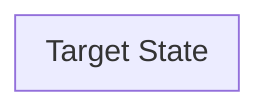

# Target State Architecture

> [!NOTE]
> Populated by `dra-analyze-input` from the scored Data Value Chain and current state observations. This page describes what the architecture should become — not a generic Salesforce pitch, but a specific recommendation anchored to the barriers and strategic priorities documented in this wiki.

**Maps to:** DRA Report Section 4 (Solution Design & Architecture) — target state half  
**Reads from:** [[04-data-value-chain]], [[05-current-state-architecture]], [[01-strategic-alignment]]  
**Drives output:** Architecture diagram slide, Solution Design section of the report

---

## Design Principles for This Customer

*Before describing the target state, state the principles that govern the architectural choices — derived from the customer's constraints, regulatory environment, and strategic priorities. These make the recommendation defensible when stakeholders push back.*

<!-- Example principles:
- "Zero Copy first: given the limited IT budget and the need for real-time data, the architecture prioritizes Zero Copy integration over ETL replication wherever Salesforce products are involved."
- "Governance precedes AI: the Trust Gap finding means no AI initiative should be scoped until MDM and lineage are in place."
- "Meet them where they are: the target state extends the customer's existing [ERP/SIS/etc.] rather than replacing it, because [reason from interviews]."
-->

---

## Layer 5 → Target: Data Foundation

*What should change at the data storage and collection layer?*

### Recommended changes

<!-- What needs to be added, replaced, or reorganized? Anchor each recommendation to a specific finding in 05-current-state-architecture or a barrier in 02-data-barriers. -->

### Salesforce role at this layer

<!-- Which Salesforce Data Cloud capabilities apply? Zero Copy connectors? Data streams? Document AI? Be specific — cite the capability, not just "Data Cloud." -->

---

## Layer 4 → Target: Connectivity, Security & Governance

*What should change about how data flows and how it's governed?*

### Recommended changes

### Salesforce role at this layer

---

## Layer 3 → Target: Intelligence & Insights

*What should change about MDM, harmonization, and analytics/ML?*

### Recommended changes

### Salesforce role at this layer

---

## Layer 2 → Target: Organizational Readiness

*What needs to change about people, process, and governance structure?*

### Recommended changes

<!-- This is often the hardest layer to sell because it's not technology — it's organizational change. Be direct about what has to be true at this layer for the technology recommendations to work. If governance doesn't change, the data catalog will collect dust. -->

### Salesforce role at this layer

---

## Layer 1 → Target: System of Action

*What does the future state look like at the mission outcomes layer — what can the organization do that it can't do today?*

### Recommended changes

### Salesforce role at this layer

<!-- Agentforce and Action Layer typically live here — this is where data becomes decisions and actions. -->

---

## Target State Architecture Diagram

<!-- Mermaid diagram of the future state. Shows Salesforce platform positioning relative to the customer's existing systems. Populated by `dra-analyze-input`; refined by the SE. -->

---

## Capability Gap Summary

*For each capability scored below 3 in [[04-data-value-chain]], what specifically needs to happen to close the gap?*

| Capability | Current Score | Gap | Recommended Action | Salesforce Capability |
|---|---|---|---|---|
| Connect | | | | |
| Integrate | | | | |
| Understand | | | | |
| Unify | | | | |
| Validate | | | | |
| Protect | | | | |
| Decide | | | | |
| Orchestrate | | | | |
| Act | | | | |

---

## Open Architecture Questions

<!-- Items that need resolution before the target state can be finalized. May require a follow-up conversation with the IT sponsor or a specific stakeholder. -->

- [ ] 
