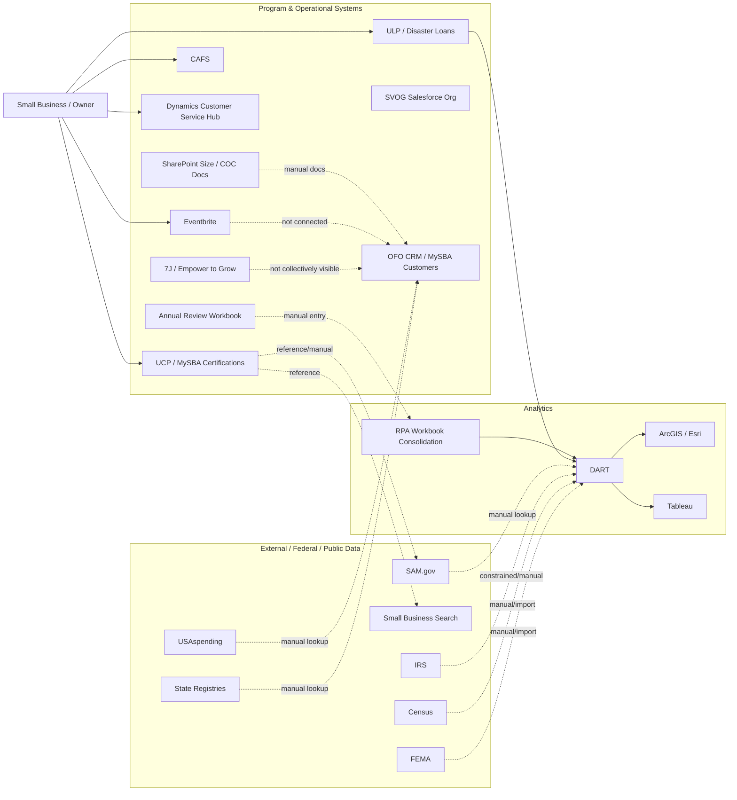

# Current State Architecture

> [!NOTE]
> Current state is based on five interviews spanning certifications (GCBD), lending (7A loan systems), investment programs (OII/SBIC), National Ombudsman, and cross-program SME discussions. System inventory is now comprehensive for lending, certifications, and investment programs. The diagram should still be validated with system owners and the existing SBA architecture deck / Lucidcharts.

**Maps to:** DRA Report Section 4 (Solution Design & Architecture) — current state half  
**Drives output:** [[06-target-state-architecture]], [[04-data-value-chain]], architecture diagram in readout

---

## Why Document Current State

The target state architecture only lands if the audience believes you understand where they are today. For SBA, current state is not one system problem; it is a many-system, many-program, many-identifier problem. The current state explains why the OneSBA / SBO 360 target state has to start with identity, integration, and governed access rather than just a new user interface. [[inputs/interviews/2026-05-07-sbo-persona-internal-sme]]

---

## System Inventory

| System | Category | Role | Integration Status | Notes |
|---|---|---|---|---|
| UCP / MySBA Certifications | Custom / Legacy / Program system | Certification system of record | Partial / unknown | Identified as system of record for certifications; does not appear to include size/COC and all related contract-analysis data. [[inputs/interviews/2026-05-07-sbo-persona-internal-sme]] |
| SAM.gov | External federal source | Entity registration, self-certification, contract data | Manual / external lookup | Used for self-certification and contracting context; creates trust-but-verify issues. [[inputs/interviews/2026-05-07-sbo-persona-internal-sme]] |
| Small Business Search / SBS | Public / external-facing search | Certified-business lookup by NAICS/geography | Reference / not system of record | Public reference tool; not authoritative. [[inputs/interviews/2026-05-07-sbo-persona-internal-sme]] |
| Size Determination / COC SharePoint folders | Document repository | Size protests, formal size determinations, certificate of competency documentation | Isolated | No system of record; documents in Team SharePoint folders. [[inputs/interviews/2026-05-07-sbo-persona-internal-sme]] |
| Annual Review Workbook | Spreadsheet / EUC | 8(a) annual review financial analysis, recommendations, feedback letter | Isolated + RPA consolidation | Blank workbook populated manually; RPA consolidates after the fact. [[inputs/interviews/2026-05-07-sbo-persona-internal-sme]] |
| OFO CRM / MySBA Customers | CRM | Tracks engagements / completed annual reviews | Partial / unclear | Used to track completed reviews and prior engagements, but not to conduct reviews. [[inputs/interviews/2026-05-07-sbo-persona-internal-sme]] |
| CAFS | Loan / financial system | Loan information lookup | Manual lookup / unknown | Field staff check for loan products before visits. [[inputs/interviews/2026-05-07-sbo-persona-internal-sme]] |
| ULP | Loan / disaster platform | Unified Lending Platform for disaster loans; includes businesses, nonprofits, homeowners, renters | Program system / partial | Used daily by ODRR; includes disaster loan processing data since 2023 and historical data from DCMS. [[inputs/interviews/2026-05-07-sbo-persona-internal-sme]] |
| DCMS / DCMS2 historical systems | Legacy disaster systems | Historical disaster loan information back to 2005 / earlier | Historical / unknown | Used as part of disaster history and analysis. [[inputs/interviews/2026-05-07-sbo-persona-internal-sme]] |
| SVOG Salesforce environment | Salesforce | Shuttered Venue Operators Grant program | Standalone | Closed grant program with ~17k applications and ~13k grants; recoupment/Treasury work remains. [[inputs/interviews/2026-05-07-sbo-persona-internal-sme]] |
| Customer Service Hub (Dynamics) | CRM / contact center | Phone/email/text intake and routing across programs | Point-to-point/manual handoff | Millions of contacts; program routing; closed-loop status not confirmed. [[inputs/interviews/2026-05-07-sbo-persona-internal-sme]] |
| DART | Analytics / BI team/process | Disaster analytics and research | Manual integration across sources | Uses many datasets for models, projections, congressional/White House reporting. [[inputs/interviews/2026-05-07-sbo-persona-internal-sme]] |
| ArcGIS / Esri | Analytics / geospatial | Disaster geography, structure/location data | Analytical tool | Provides structure/geographic data but not complete business information. [[inputs/interviews/2026-05-07-sbo-persona-internal-sme]] |
| Tableau | Analytics / BI | Disaster and program analytics | Analytical tool | Used by DART. [[inputs/interviews/2026-05-07-sbo-persona-internal-sme]] |
| Eventbrite | Event management | Field-office event creation, registration, reminders | Isolated | Attendance/registration not connected to MySBA Customers. [[inputs/interviews/2026-05-07-sbo-persona-internal-sme]] |
| 7J / Empower to Grow | Assistance program | Technical-assistance training funded through 7J | Fragmented / not visible collectively | Assistance usage not consistently visible in business profile. [[inputs/interviews/2026-05-07-sbo-persona-internal-sme]] |
| USAspending | External federal source | Spending footprint / location analysis | Manual lookup | Used by field staff for analysis. [[inputs/interviews/2026-05-07-sbo-persona-internal-sme]] |
| Secretary of State databases | External state source | Business lookup / industry context | Manual lookup | Used by field offices; hard to pull data. [[inputs/interviews/2026-05-07-sbo-persona-internal-sme]] |
| IRS / Census / FEMA / Treasury | External federal sources | Tax, business, disaster, and federal partner data | Constrained/manual | High-value data sources; access limitations and MOUs may be required. [[inputs/interviews/2026-05-07-sbo-persona-internal-sme]] |
| NOCMS (National Ombudsman Case Management System) | Cold Fusion / Legacy | Complaint intake, case tracking, agency coordination | Isolated | External-facing portal for small business enforcement complaints; no integration with SBA lending systems; aging infrastructure with "level two" performance. [[inputs/interviews/2026-07-06-national-ombudsman-natalie]] |
| Power BI (NOCMS reporting) | Analytics / BI | National Ombudsman case reporting and metrics | Analytical layer on NOCMS | Data discrepancies between NOCMS and Power BI (e.g., 499 vs 521 cases) indicate ETL or data-quality issues. [[inputs/interviews/2026-07-06-national-ombudsman-natalie]] |
| **PIM** (Partner Information Management) | Loan / lender system | Stores all lender information; lenders must be certified yearly | Unknown | Central lender registry for SBA loan programs. [[inputs/interviews/2026-07-06-7a-loan-process-structured-findings]] |
| **E-Tran** (Electronic Transaction System) | Core loan system | Core loan guarantee tracking system across loan types | "Common area" across programs | Common touchpoint for 7A, disaster, and other loan types, but different life cycles. [[inputs/interviews/2026-07-06-7a-loan-process-structured-findings]] |
| **GPTS** (Guarantee Purchase/Portfolio Tracking System) | Loan servicing | Manages purchased/defaulted loans that SBA takes over | Separate workflow from active loans | Separate payment workflows from ULP; loan moves from ULP to GPTS when purchased/defaulted. [[inputs/interviews/2026-07-06-7a-loan-process-structured-findings]] |
| **iCAP** | CRM / Salesforce + custom portal | New system being piloted to replace lender experience | Salesforce-based modernization | Modernization initiative; Salesforce CRM + custom portal for lender portal replacement. [[inputs/interviews/2026-07-06-7a-loan-process-structured-findings]] |
| **Lender Match** | Borrower-lender matching | Tool for borrowers to find lenders | Isolated / recently modernized | Recently modernized but no integration with E-Tran; cannot track match-to-guarantee conversion. [[inputs/interviews/2026-07-06-7a-loan-process-structured-findings]] |
| **LLMS** (Loan and Lender Management System) | Analytics / BI | Portfolio risk analysis and reporting | Tableau-based | Analyst-driven portfolio analytics. [[inputs/interviews/2026-07-06-7a-loan-process-structured-findings]] |
| **CLS** | Identity / Access Management | Homegrown identity/access management | Legacy / being replaced | Custom/legacy IdAM being replaced by Okta. [[inputs/interviews/2026-07-06-7a-loan-process-structured-findings]] |
| **Okta** | Identity / Access Management | Commercial IdAM platform | Being adopted | Being adopted to replace CLS. [[inputs/interviews/2026-07-06-7a-loan-process-structured-findings]] |
| **SBIC Web** | Investment program system | Legacy system for SBIC (Small Business Investment Company) program | Legacy / being replaced | "Spending 100s of thousands of dollars a year to patch" — needs replacement. Salesforce replacement in progress. [[inputs/interviews/2026-05-XX-morris]] |
| **1031 financing reports** | Investment tracking | Track every SBIC investment and portfolio company | Manual reporting | Manual reporting burden; no automated analysis. [[inputs/interviews/2026-05-XX-morris]] |
| **SBIR.gov** | Grant coordination portal | External portal for SBIR/STTR grant information | External-facing | Managed by SBA but funds flow from other agencies. [[inputs/interviews/2026-05-XX-morris]] |
| **HUBZone Map** | Geospatial / Certification | Geographic eligibility verification | GIS / shapefile data | Located at maps.certified.sba.gov; uses GIS for HUBZone determination. [[inputs/interviews/2026-06-XX-gcbd-hillary-certifications]] |
| **Octa** | Identity / SSO | Identity management and SSO | Recently added | "Caused quite the kerfuffle" during rollout; identity verification for certifications. [[inputs/interviews/2026-06-XX-gcbd-hillary-certifications]] |
| **ULP / Alecourt / MuleSoft APIs** | Integration / Automation | Straight-through processing data sources | Being integrated for automation | Federal liens, incarceration status, VA verification for straight-through certification processing. [[inputs/interviews/2026-06-XX-gcbd-hillary-certifications]] |
| **MuleSoft Government Cloud** | iPaaS / Integration platform | Primary integration engine connecting Salesforce to Oracle + CAFS | FedRAMP Moderate ATO — **in production** | Already deployed; connects iCAP and straight-through processing automation. Not a greenfield — the integration *platform* exists. Upgrade path to Integrate score 3 is coverage extension, not new platform. [[inputs/research/2026-07-06-gemini-capture]] |
| **Oracle E-Business Suite** | ERP | Central enterprise resource planning | Core system | 5-year $7.99M support contract awarded June 2026 to CSS Federal via GSA 8(a) STARS III. Connected to Salesforce via MuleSoft Government Cloud. [[inputs/research/2026-07-06-gemini-capture]] |
| **DLAP (Disaster Loan Application Portal)** | Loan application / disaster | Disaster loan applications; separate from ULP | CAFS backend | Distinct from the Unified Lending Platform; CAFS is the backend data store. [[inputs/research/2026-07-06-gemini-capture]] |
| **data.sba.gov** | Analytical data infrastructure | Public open data portal | CKAN platform with API access | 42 public datasets covering SBA programs; evidence of data-driven culture. [[inputs/research/2026-07-07-claude-capture]] |
| **datahub.certify.sba.gov** | Analytical data infrastructure | Interactive contracting analytics hub | React-based external-facing portal | Procurement scorecards back to 2007; certifications contracting analytics. [[inputs/research/2026-07-07-claude-capture]] |

---

## Layer 5: Data Foundation

### What they have

SBA has many rich source systems and datasets: UCP, CAFS, ULP, historical DCMS, SVOG, CSH, SharePoint archives, Eventbrite, 7J/Empower to Grow, DART datasets, ArcGIS, Tableau, SAM.gov, Small Business Search, USAspending, IRS, Census, FEMA, Treasury, and state business registries. [[inputs/interviews/2026-05-07-sbo-persona-internal-sme]]

### Pain points

- Data is abundant but not assembled around a common small-business-owner profile. [[inputs/interviews/2026-05-07-sbo-persona-internal-sme]]
- Some important data is trapped in documents, spreadsheets, SharePoint folders, or external/public sources rather than system APIs. [[inputs/interviews/2026-05-07-sbo-persona-internal-sme]]
- Historical and disaster data exists, but teams still have to manually combine it with external and field-reported data. [[inputs/interviews/2026-05-07-sbo-persona-internal-sme]]
- NOCMS holds complaint/enforcement data but has no connection to lending systems (ULP/CAFS), preventing the National Ombudsman from verifying loan status or aggregating complaints by regulation. [[inputs/interviews/2026-07-06-national-ombudsman-natalie]]
- **No unified borrower identity across loan types:** Same person with 7A, disaster, microloan, or SBIC loans cannot be linked. E-Tran is common touchpoint but no entity resolution. [[inputs/interviews/2026-07-06-7a-loan-process-structured-findings]]
- **SBIC and 7A loan systems siloed:** Cannot flag entities across investment and lending programs for fraud detection. [[inputs/interviews/2026-05-XX-morris]]
- **Contracts data not accessible from UCP:** Certification staff cannot see contract performance for risk-based reviews. GSA API not available. [[inputs/interviews/2026-06-XX-gcbd-hillary-certifications]]
- **1502 reporting is monthly batch:** Banks manually upload transaction summaries creating 30-day data lag instead of real-time integration. [[inputs/interviews/2026-07-06-7a-loan-process-structured-findings]]

---

## Layer 4: Connectivity, Security & Governance

### What they have

SBA has some system-level authority and tooling: UCP as certification system of record, CSH as intake/routing hub, RPA for workbook consolidation, Tableau/ArcGIS for analytics, program-specific access to external datasets, and MuleSoft for straight-through processing integration (emerging). [[inputs/interviews/2026-05-07-sbo-persona-internal-sme]] [[inputs/interviews/2026-06-XX-gcbd-hillary-certifications]]

Identity management modernization underway: CLS being replaced by Okta, Octa added for SSO (though rollout was "quite the kerfuffle"). [[inputs/interviews/2026-07-06-7a-loan-process-structured-findings]] [[inputs/interviews/2026-06-XX-gcbd-hillary-certifications]]

### Pain points

- Annual review workflows cannot API-connect to source data. [[inputs/interviews/2026-05-07-sbo-persona-internal-sme]]
- External data access such as IRS and SAM.gov is constrained/manual and may require data-sharing agreements. [[inputs/interviews/2026-05-07-sbo-persona-internal-sme]]
- Sensitive data exists in multiple places — tax records, owner relationships, loans, disaster data, SharePoint documents — but this interview did not establish an enterprise policy-enforcement pattern. [[inputs/interviews/2026-05-07-sbo-persona-internal-sme]]
- NOCMS has no integration with SBA lending systems; IG Act protections create one-way data flow (can receive, cannot share), which may complicate reciprocal integration patterns. [[inputs/interviews/2026-07-06-national-ombudsman-natalie]]
- **GSA relationship issues:** Hillary describes GSA as "probably the worst at government to government internal customer service." Five-year wait for veterans certifications in SAM.gov. FPDS-NG constant changes. [[inputs/interviews/2026-06-XX-gcbd-hillary-certifications]]
- **Legacy system integration challenges:** SBIC Web spending "100s of thousands/year to patch" because too old for modern service providers. UCP rebuilt 4 times in 8 years. [[inputs/interviews/2026-05-XX-morris]] [[inputs/interviews/2026-06-XX-gcbd-hillary-certifications]]
- **Identity management rollout pain:** Octa SSO "caused quite the kerfuffle" suggesting governance controls being added reactively. [[inputs/interviews/2026-06-XX-gcbd-hillary-certifications]]

---

## Layer 3: Intelligence & Insights

### What they have

- DART performs disaster analytics and projections using ArcGIS, Tableau, ULP, historical data, FEMA, Census, IRS, and other sources. [[inputs/interviews/2026-05-07-sbo-persona-internal-sme]]
- Annual Review Workbooks perform financial analysis and generate recommendations for 8(a) firms. [[inputs/interviews/2026-05-07-sbo-persona-internal-sme]]
- Field staff use external sources such as USAspending, Small Business Search, SAM.gov, and Secretary of State data to understand geographies and businesses. [[inputs/interviews/2026-05-07-sbo-persona-internal-sme]]

### Pain points

- Analytics are often assembled manually and not embedded into an enterprise profile or workflow. [[inputs/interviews/2026-05-07-sbo-persona-internal-sme]]
- NAICS codes are too broad to represent actual business capability, and more granular external directories are not linked to SBA records. [[inputs/interviews/2026-05-07-sbo-persona-internal-sme]]
- Duplicate data collection across disaster offices undermines analytical efficiency and consistency. [[inputs/interviews/2026-05-07-sbo-persona-internal-sme]]
- National Ombudsman cannot aggregate complaint data by regulation or agency, preventing pattern detection and proactive policy feedback. Power BI vs NOCMS discrepancies (499 vs 521 cases) undermine trust in reporting. [[inputs/interviews/2026-07-06-national-ombudsman-natalie]]

---

## Layer 2: Organizational Readiness

### What they have

The session shows cross-program collaboration across OCIO, GCBD, OFO, ODRR, field staff, certification experts, disaster analytics, and program SMEs. There is strong awareness of the OneSBA goal and the need to break down silos. [[inputs/interviews/2026-05-07-sbo-persona-internal-sme]]

### Pain points

- Each program office has its own operating context, systems, identifiers, and data needs. [[inputs/interviews/2026-05-07-sbo-persona-internal-sme]]
- Some important knowledge lives in SMEs' explanations of processes, not in shared metadata or formal semantic models. [[inputs/interviews/2026-05-07-sbo-persona-internal-sme]]
- Direct governance, ownership, and funding model were not fully evidenced in this input. [[inputs/interviews/2026-05-07-sbo-persona-internal-sme]]

---

## Layer 1: System of Action

### What they have

SBA has clear action domains: certification, lending, disaster assistance, technical assistance, event outreach, field visits, contact center routing, annual reviews, market research, and program-impact reporting. [[inputs/interviews/2026-05-07-sbo-persona-internal-sme]]

### Pain points

- Insights often do not flow directly into staff action; staff must search, interpret, and assemble context before acting. [[inputs/interviews/2026-05-07-sbo-persona-internal-sme]]
- Proactive disaster awareness and cross-program recommendations are target-state ideas rather than demonstrated automated capabilities. [[inputs/interviews/2026-05-07-sbo-persona-internal-sme]]
- Event and assistance interactions do not automatically update the business profile, limiting personalized next-best action. [[inputs/interviews/2026-05-07-sbo-persona-internal-sme]]

---

## Integration Landscape

### Current integration patterns

Current patterns include manual lookup, spreadsheet entry, SharePoint document storage, program-specific system use, public website search, RPA consolidation, contact center routing, and analytical assembly in Tableau/ArcGIS. Some systems are authoritative for a narrow domain, but the enterprise integration layer needed for a unified SBO profile is not evidenced in this input. [[inputs/interviews/2026-05-07-sbo-persona-internal-sme]]

### Known brittle points

- Blank annual-review workbooks and RPA consolidation. [[inputs/interviews/2026-05-07-sbo-persona-internal-sme]]
- Size/COC documentation in SharePoint. [[inputs/interviews/2026-05-07-sbo-persona-internal-sme]]
- Eventbrite attendance not connected to MySBA Customers. [[inputs/interviews/2026-05-07-sbo-persona-internal-sme]]
- CSH resolution feedback loop not confirmed. [[inputs/interviews/2026-05-07-sbo-persona-internal-sme]]
- Manual external data access for IRS/SAM/Census-style analysis. [[inputs/interviews/2026-05-07-sbo-persona-internal-sme]]
- Duplicate disaster data gathering across offices/divisions. [[inputs/interviews/2026-05-07-sbo-persona-internal-sme]]

### IRS §6103 — Structural Legal Constraint

> [!WARNING]
> IRS §6103 is not a technical gap or a data-quality problem. It is a legal boundary.

SBA is **legally blocked** from accessing IRS tax records directly without explicit per-transaction applicant consent under Section 6103(c) of the Internal Revenue Code. The current workflow — physical 4506-T (individual) and 4506-C (business) forms with manual signature verification by both SBA and IRS personnel — is legally required, not a legacy process waiting to be automated away. [[inputs/research/2026-07-06-gemini-capture]]

Implications:
- Integration architects cannot treat IRS data as a standard API endpoint. Any IRS data flow requires a documented, per-transaction consent mechanism.
- During COVID EIDL, SBA bypassed IRS validation due to backlogs — subsequent audits found ~50% of EIDL files lacked verifiable tax documents. This is the fraud/compliance risk of working around §6103, not a justification for doing so.
- GAO report (GAO-26-107682) recommends more efficient IRS data sharing for disaster loans — a recommendation, not a current capability.
- **IRS MoU renewal deadline: October 31, 2027.** This is the natural procurement window for a digital consent capture solution. Any roadmap item involving IRS data automation should be sequenced around this date. [[inputs/research/2026-07-06-gemini-capture]]

### Analytical Data Infrastructure

Beyond operational and program systems, SBA maintains public-facing analytical data infrastructure:

- **data.sba.gov** — 42 public datasets on a CKAN platform with API access. Covers lending, certifications, contracting, and disaster programs. Evidence of data-driven culture but not an internal enterprise data foundation. [[inputs/research/2026-07-07-claude-capture]]
- **datahub.certify.sba.gov** — Interactive React-based contracting analytics hub. Procurement scorecards back to 2007. Used for certifications contracting analytics. [[inputs/research/2026-07-07-claude-capture]]
- **PEER registry** — 37+ program evaluation reports; annual Evidence Plans; FY 2026 Evidence Capacity Assessment. Confirms evidence-based performance culture. [[inputs/research/2026-07-07-claude-capture]]

### Salesforce footprint

Research confirms the following Salesforce deployment details, corroborating and extending what interviews established: [[inputs/research/2026-07-06-gemini-capture]]

| Component | Details |
|---|---|
| **MySBA / SBA Digital Platform** | Salesforce GovCloud Plus on isolated AWS GovCloud (US) |
| **MySBA Certifications** | Salesforce Public Sector Solutions (PSS); interfaces SAM.gov API + legacy Certify database |
| **MySBA Loan Portal** | Experience Cloud + Financial Services Cloud; backend is CAFS; at lending.sba.gov |
| **Small Business Search (SBS)** | Platform App Services; replaced legacy DSBS |
| **Salesforce Data Cloud** | On AWS GovCloud; FedRAMP High baseline available; identity resolution + zero-copy + federated data spaces are available capabilities |
| **iCAP** | Salesforce CRM + custom portal for lender portal replacement; MuleSoft-connected |
| **SVOG** | Standalone Salesforce environment for Shuttered Venue Operators Grant (legacy; recoupment work ongoing) |
| **OFO CRM / MySBA Customers** | Salesforce CRM for field office engagement tracking |

> [!NOTE]
> Salesforce Data Cloud is available at FedRAMP High on AWS GovCloud — this means the identity resolution and zero-copy capabilities relevant to the DRA target state are already FedRAMP-authorized for SBA's environment. This is a significant architectural advantage. [[inputs/research/2026-07-06-gemini-capture]]

---

## Current State Architecture Diagram

---

## Key Observations for Target State

SBA's current architecture is rich in data but weak in enterprise cohesion: every major program has useful information, but no shared SBO identity spine connects it all. The highest-leverage target-state entry point is a unified SBO profile backed by API-led integration and governed external-data access, not another standalone application. [[inputs/interviews/2026-05-07-sbo-persona-internal-sme]]

A target architecture should treat Salesforce / Data Cloud as the system of action and profile activation layer, MuleSoft Government Cloud as the integration backbone (already deployed with FedRAMP Moderate ATO), and analytical platforms such as Tableau/ArcGIS as systems of intelligence — while preserving each mission system's role as a domain source of record. [[inputs/interviews/2026-05-07-sbo-persona-internal-sme]]

Research confirms the key components of this target architecture are already present in the SBA environment: Salesforce GovCloud Plus (MySBA platform), Salesforce Data Cloud (FedRAMP High on AWS GovCloud), MuleSoft Government Cloud (FedRAMP Moderate, already integrated), and Oracle E-Business Suite as the ERP. The DRA target state is not a greenfield build — it is integration and activation of an already-authorized Salesforce stack on a data foundation that does not yet exist. [[inputs/research/2026-07-06-gemini-capture]]
