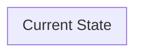

# Current State Architecture

> [!NOTE]
> Populated by `dra-analyze-input`. This page documents what the customer has today — systems, integrations, and pain points at the technical layer. It is the factual foundation that makes the Target State story credible.

**Maps to:** DRA Report Section 4 (Solution Design & Architecture) — current state half  
**Drives output:** [[06-target-state-architecture]], [[04-data-value-chain]] (Connect / Integrate scores), architecture diagram in readout

---

## Why Document Current State

The target state architecture only lands if the audience believes you understand where they are today. Skipping current state — or getting it wrong — signals that the recommendation was written generically, not for them. Current state documentation also forces clarity about *why* the gaps exist: a legacy ERP that predates APIs is a different problem than a modern system with no integration budget.

This page maps to the 5-Layer Data Architecture Blueprint from the DRA framework. Not all layers will be populated for every customer — depth varies by interview coverage.

---

## System Inventory

*The authoritative list of data-relevant systems currently in use. Built from interview transcripts, survey responses, and any architecture diagrams the customer provided.*

| System | Category | Role | Integration Status | Notes |
|---|---|---|---|---|
| | | | | |

**Categories:** CRM · ERP · SIS (Student Info) · HRIS · Data Warehouse · Data Lake · Analytics / BI · Identity / IAM · Custom / Legacy · Other

**Integration Status:** Isolated (no integration) · Point-to-Point · API-connected · Real-time / Streaming · Zero Copy / Federated

---

## Layer 5: Data Foundation

*Structured databases, big data ecosystems, document/record management, semi/unstructured data stores.*

### What they have

<!-- List the data foundation systems from the inventory above that belong at this layer. Note any major gaps — e.g., no data lake, or a data lake that isn't actually used. -->

### Pain points

<!-- What's technically broken or missing at this layer? Source each point. -->

---

## Layer 4: Connectivity, Security & Governance

*Data catalog, security/privacy controls, orchestration, app/data integration, quality/observability.*

### What they have

### Pain points

---

## Layer 3: Intelligence & Insights

*MDM, harmonization & unification, ML/AI, analytics.*

### What they have

### Pain points

---

## Layer 2: Organizational Readiness

*People, process, data governance structure, data principals.*

### What they have

<!-- Who owns data governance? Is there a data steward role? Is there a data strategy? Are there formal data ownership assignments? -->

### Pain points

---

## Layer 1: System of Action

*Mission outcomes, data strategy, semantic model, data lifecycle management.*

### What they have

<!-- Does a data strategy document exist? Is there a semantic/ontological model? Does the organization have a stated data lifecycle policy? -->

### Pain points

---

## Integration Landscape

*How data currently moves between systems — the connective tissue between the layers above.*

### Current integration patterns

<!-- Describe the dominant patterns: "Most integrations are batch ETL jobs that run nightly from the ERP to the data warehouse. Ad-hoc requests are handled by IT exporting CSV files." -->

### Known brittle points

<!-- Integrations that break, require manual intervention, or that stakeholders flagged as high-maintenance. Source each. -->

### Salesforce footprint (if any)

<!-- What Salesforce products are currently in use? How are they integrated with other systems? This scopes the Zero Copy opportunity. -->

---

## Current State Architecture Diagram

<!-- Mermaid diagram showing key systems and data flows. Populated by `dra-analyze-input` based on the system inventory and integration patterns above. Start with what's known; add as more interviews land. -->

---

## Key Observations for Target State

<!-- 2–4 sentences: What does this current state tell us about what needs to change first? What does it make obvious about the right entry point for Salesforce Data + AI? This feeds directly into the opening framing of 06-target-state-architecture. -->
